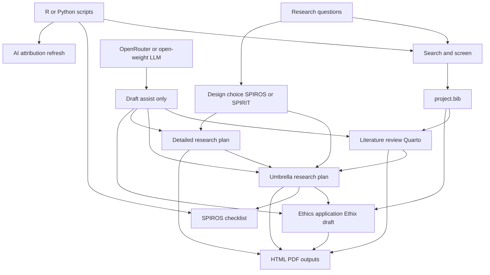

# Purpose

I will produce linked documents for this project on AI-assisted personalised perioperative management:

1. A short literature review
2. An **umbrella** research plan for ethics (stable, broad)
3. A **detailed** research plan for day-to-day work (specific, living)
4. An ethics application pack for Etikprövningsmyndigheten / Ethix
5. A maintained bibliography
6. A public AI-writing attribution ledger with running totals

I will write in first person. I will use short, direct sentences. I will avoid filler, hype, and vague AI language.

# Study framing first

Before drafting, I will decide the primary design. That choice sets the reporting guideline.

| Design | Guideline | Use in this project |
|--------|-----------|---------------------|
| Observational (cohort, case-control, cross-sectional), including chart review and association studies | **SPIROS** | Likely primary path: chart review, fitness assessment from records, associations between patient variables and outcomes |
| Interventional / randomised trial of an AI-supported pathway | **SPIRIT 2025** | Use if we test an agent-supported management pathway against usual care |

I expect a mixed programme:

- An observational protocol under SPIROS for retrospective or prospective chart-based work
- A separate interventional protocol under SPIRIT if we later test agent-supported plans in practice

I will not force one checklist onto both designs.

# Deliverables

## 1. Short literature review

**File:** `docs/literature-review.qmd`  
**Length target:** 1,500–2,500 words  
**Output:** HTML and PDF via Quarto

### Scope questions

I will answer only these questions:

1. What is known about preoperative risk assessment and personalised perioperative planning?
2. Where do chart review and structured clinical data already support fitness-for-anaesthesia decisions?
3. What evidence exists for LLM or agent systems in clinical documentation, triage, or care planning?
4. What safety, bias, privacy, and accountability gaps remain for perioperative use?
5. What gap does this project address?

### Structure

1. Background and clinical problem
2. Current perioperative assessment practice
3. Data-driven personalisation
4. AI agents and open-weight models in clinical workflows
5. Risks, governance, and evidence gaps
6. Implications for this study
7. References

### Method for the review

1. Define inclusion criteria (perioperative OR anaesthesia; personalisation OR risk prediction; LLM OR clinical decision support).
2. Search PubMed, Scopus, and grey sources (guidelines, HTA, regulator notes).
3. Export citations to BibTeX (`references/project.bib`).
4. Screen titles and abstracts in a simple R or Python table.
5. Extract: design, population, intervention/exposure, outcomes, limitations.
6. Synthesise by theme, not by paper dump.
7. Mark confidence: strong evidence, limited evidence, speculation.

### Tool use

- **BibTeX** for all citations
- **R or Python** for screening logs and simple evidence tables
- **OpenRouter / open-weight LLM** only for: search-string drafts, clustering themes, spotting missing sections
- Human review for every claim tied to a citation

I will not let a model invent references. Every citation must exist in `project.bib` and be checked.

## 2. Two research plans

See also `docs/two-research-plans.md`.

| Plan | File | Role |
|------|------|------|
| Umbrella (ethics) | `docs/research-plan-umbrella.qmd` | Annex to Ethix; SPIROS map; broad bounds |
| Detailed (internal) | `docs/research-plan-detailed.qmd` | Guides day-to-day research work; may change often |

**Companion checklists:** `checklists/spiros-checklist.md`, `checklists/spirit-2025-checklist.md` (if interventional)

### Core research aims (draft, shared)

1. Assess whether an AI agent can extract and structure preoperative fitness signals from medical charts.
2. Draft personalised perioperative management suggestions from those signals.
3. Study associations between patient-level variables and perioperative outcomes.
4. Define human oversight, error modes, and escalation rules before any clinical use.

### Umbrella plan rules

I will write the ethics plan so ordinary method tweaks do not need an ändringsansökan.

Include: aims, design family, population/setting bounds, data categories, processing principles, oversight, risk classes, dissemination.

Avoid locking: exact models, prompts, library versions, sprint boards, dashboard wireframes.

State contingent future interventional work under SPIRIT only as a possibility, not as an unapproved commitment to start.

### Detailed plan rules

I will keep operational detail here. Every major workstream must map to an umbrella aim. If a change leaves the umbrella bounds, I stop and prepare an Ethix amendment first.

### SPIROS map (observational track — umbrella)

I will cover the six SPIROS domains in the umbrella plan:

1. **General information** — title, registration, protocol version, roles
2. **Introduction** — rationale, objectives, hypotheses
3. **Methods** — design, setting, participants, variables, data sources, bias, sample size, analysis
4. **Ethical considerations** — consent model, privacy, harms, data governance
5. **Reporting and dissemination** — outputs, authorship, open materials, AI-writing ledger
6. **Other** — AI-assisted writing disclosure, funding, conflicts, amendments

I will state explicitly when an item does not apply.

### SPIRIT map (interventional track, if used)

If we later test an agent-supported pathway, I will add a separate SPIRIT 2025 protocol rather than overloading the observational umbrella:

- Intervention and comparator description
- Randomisation and blinding (or justification for open label)
- Schedule of enrolment, interventions, and assessments
- Harms surveillance for the digital intervention
- Patient and public involvement
- Open science section (data, code, materials)

### Analysis and reproducibility

- Pre-specify primary and secondary endpoint *families* in the umbrella plan
- Put exact estimators, splits, and code paths in the detailed plan / SAP
- Separate derivation and evaluation where models are involved
- Store analysis code in `scripts/`
- Freeze a statistical analysis plan before outcome analysis
- Record model names, versions, prompts, temperature, and retrieval settings in the detailed plan

## 3. Ethics application (Etikprövningsmyndigheten / Ethix)

**Target authority:** Etikprövningsmyndigheten  
**Submission system:** Ethix (login portal; Grundansökan / Ändringsansökan)  
**Language:** Swedish in the Ethix form  
**File:** `docs/ethics-application.qmd` (working draft aligned to Ethix fields)  
**Annexes:** forskningspersonsinformation, samtycke, research plan, data flow, risk register

### API reality check

I cannot submit or fill Ethix through an application API.

- Ethix itself has no public write API for drafting or lodging applications.
- Applications must be entered in the Ethix portal by an authorised user.
- The authority publishes a **statistics** API/portal for aggregated research statistics. That is read-only analytics, not a submission interface.

So I will draft offline text mapped to Ethix questions. A human will paste and submit in Ethix.

### What I need from you

Prefer one of these, in order:

1. **Best:** an export, screenshots, or field list from the current Ethix Grundansökan (sections and question text as shown today)
2. **Good:** your institutional template already adapted to Ethix
3. **Fallback:** I draft against the authority’s published English guidance PDF of the initial application form, knowing it may lag the live Ethix form (new forms are expected during 2026)

Also useful: the current official stödmallar for forskningspersonsinformation and samtycke, if your local version differs.

### Content blocks (mapped for Ethix paste-in)

1. Lay summary / projektbeskrivning in plain Swedish
2. Scientific background (short; cite the literature review)
3. Aims and design
4. Participants and data sources
5. Recruitment or record access pathway
6. Consent, waiver, or opt-out rationale under etikprövningslagen
7. Data minimisation and de-identification (känsliga personuppgifter)
8. Model and vendor risk (OpenRouter, local open-weight models, logs, retention)
9. Clinical safety: no autonomous decisions; clinician remains accountable
10. Bias, equity, and failure modes
11. Incident reporting
12. Benefit–risk balance
13. Dissemination and data sharing limits
14. Bilagor list matching Ethix upload expectations

### AI-specific ethics points I will address

- Charts may contain identifiers; prompts must not leave approved environments unless approved
- Prefer local or controlled open-weight inference for identifiable text where feasible
- If OpenRouter or similar APIs are used, document subprocessors, retention, and contractual controls
- Store prompts and outputs only as allowed by the REC/IRB and data controller
- Prohibit clinical deployment until evaluation and governance gates are met

### Alignment

Ethics text and Ethix answers must match the **umbrella** plan. The detailed plan may be richer, but not wider. I will not submit divergent aims, populations, or processing routes.

## 4. Bibliography

**File:** `references/project.bib`  
**Review helper:** `scripts/bibliography_check.py` or `.R`

### Rules

- One shared BibTeX file for all Quarto docs
- Stable keys: `FirstAuthorYearShortTitle`
- Prefer DOIs
- Include SPIRIT 2025, SPIROS materials, STROBE/CONSORT as relevant, and core perioperative and AI-safety sources
- Tag entries with keywords: `perioperative`, `llm`, `ethics`, `methods`

### Maintenance

1. Add sources during screening
2. Deduplicate
3. Verify DOIs and titles
4. Render Quarto and fix missing citations
5. Export a plain reference list for the ethics pack if required

## 5. AI-writing attribution ledger

See `docs/ai-transparency.md`.

I will be explicit about AI-authored text and code.

### Per commit

- Add trailer `AI-Written-Pct: <0-100>` to each content commit
- Or backfill via `meta/ai-attribution-overrides.csv`

### Totals

```bash
python scripts/ai_attribution.py refresh
```

This writes:

- `meta/ai-attribution.csv` — one row per commit
- `meta/ai-attribution-summary.md` — weighted and unweighted totals

Primary disclosure figure: **weighted AI-written share** using lines added as weights.

### Ethics use

I will cite the current weighted total in the umbrella plan and Ethix AI-disclosure answers. I will refresh before submission.

# Tooling workflow



## Quarto

- One project (`_quarto.yml`) with shared bibliography and styles
- Separate `.qmd` files for review, plan, and ethics
- Cross-references between documents
- Render to HTML for editing and PDF for submission

## BibTeX

- Single source of truth in `references/project.bib`
- Cite with `@key` in Quarto
- Keep checklist citations in the same file

## R / Python

Use scripts for:

- Search string logs
- Screening decisions
- Evidence tables
- Simple sample-size or precision calculations
- Bibliography validation (missing DOI, empty year, duplicate titles)
- AI attribution refresh (`scripts/ai_attribution.py`)

Do not use notebooks as the only record. Keep runnable scripts in `scripts/`.

## OpenRouter and open-weight LLMs

Allowed assistive uses:

- Outline critique against SPIROS/SPIRIT checklists
- Plain-language rewrite of my drafts (I keep final wording)
- Red-team prompts for ethics risks
- Clustering themes from screened abstracts I supply

Disallowed:

- Fabricating papers or quotations
- Silent rewriting that adds claims without sources
- Sending identifiable patient data to external APIs without approval

I will disclose AI assistance in the protocol (SPIROS item on AI-assisted technology) and keep the attribution ledger current.

# Writing rules for all documents

1. First person where I state plans and judgements
2. Short sentences
3. Concrete verbs
4. Define acronyms once
5. No marketing tone around AI
6. Prefer “I will measure X” over “this cutting-edge system will revolutionise Y”
7. Separate evidence, plan, and speculation

# Work sequence

| Step | Task | Output |
|------|------|--------|
| 0 | Confirm primary design and data access route | One-page design note |
| 1 | Quarto, BibTeX, dual-plan stubs, AI ledger | Repo scaffold |
| 2 | Draft umbrella plan bounds for Ethix | `research-plan-umbrella.qmd` |
| 3 | Draft detailed plan inside those bounds | `research-plan-detailed.qmd` |
| 4 | Build search strategy and bibliography | `project.bib` |
| 5 | Screen and theme evidence | Screening table |
| 6 | Draft short literature review | `literature-review.qmd` |
| 7 | Draft Ethix answers from umbrella plan | `ethics-application.qmd` |
| 8 | Consistency pass: detailed ⊆ umbrella; AI ledger refreshed | Issue list closed |
| 9 | External review | Revised PDFs |
| 10 | Submit Ethix; register if required | Submission pack |

# Acceptance criteria

I will treat the package as ready when:

- The literature review answers the five scope questions and cites only verified BibTeX entries
- The umbrella plan completes SPIROS (and notes any SPIRIT contingency), with explicit N/A notes
- The detailed plan maps each workstream to an umbrella aim and stays inside umbrella bounds
- The ethics draft matches the umbrella plan and maps to current Ethix fields
- Swedish paste-ready answers exist for Ethix; submission remains manual
- All Quarto documents render cleanly with one bibliography
- Every content commit has an AI % (trailer or override); weighted total is published in `meta/ai-attribution-summary.md`
- No identifiable patient text has been sent to unapproved services

# Immediate next actions

1. Write a one-page design note: population, data source, observational vs interventional, primary outcome
2. Obtain current Ethix field list / institutional template
3. Fill umbrella plan bounds first, then detailed-plan content
4. Expand `project.bib` and run searches
5. Complete SPIROS checklist against the umbrella plan
6. Draft Ethix-aligned Swedish answers and FPI/samtycke
7. Keep `AI-Written-Pct` on every commit and refresh the ledger

# Key references to seed early

- SPIRIT 2025 statement and explanation & elaboration
- SPIROS checklist and explanation materials (Maastricht / EQUATOR-linked resources)
- STROBE for later results reporting of observational analyses
- Local institutional guidance and national health-data rules relevant to chart review
- Etikprövningsmyndigheten Ethix guidance and stödmallar
